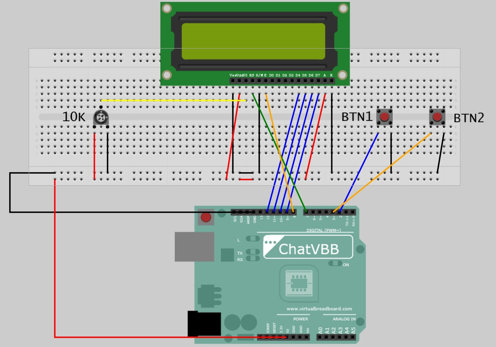
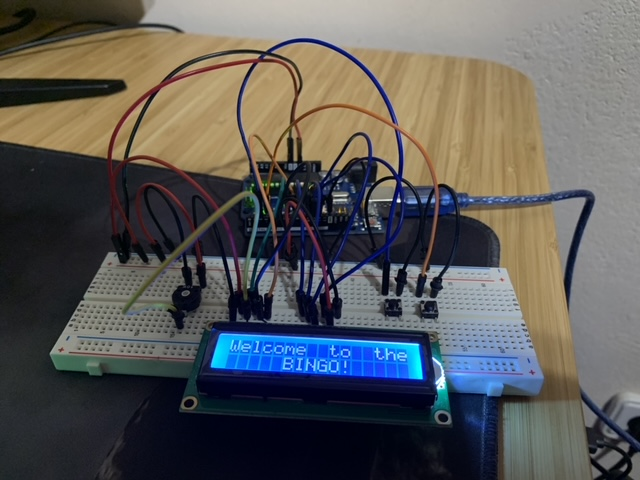

# ArduBingo

The **Ardubingo Project** takes the classic game of bingo and gives it a techy twist, turning it into a fun and hands-on way to learn electronics and coding. It’s all about capturing the same excitement of shouting “bingo!” but with the added thrill of creating something awesome along the way.

## Installation

- Arduino IDE to download the sketch into your Arduino UNO

## Wiring diagram

Note: The orientation of the pins varies depending on the LCD Screen model. Take a look at which pins are connected.

## Usage

### Start Screen

If you didn't get the first number of screen, click on BTN1 to get the first one.

### Get next number

Click on BTN1 to withdraw another number.

### See old numbers

Click on BTN2 to check which number has been withdrawn.

## Contributing

Pull requests are welcome. For major changes, please open an issue first
to discuss what you would like to change.

## License

[MIT](https://choosealicense.com/licenses/mit/)